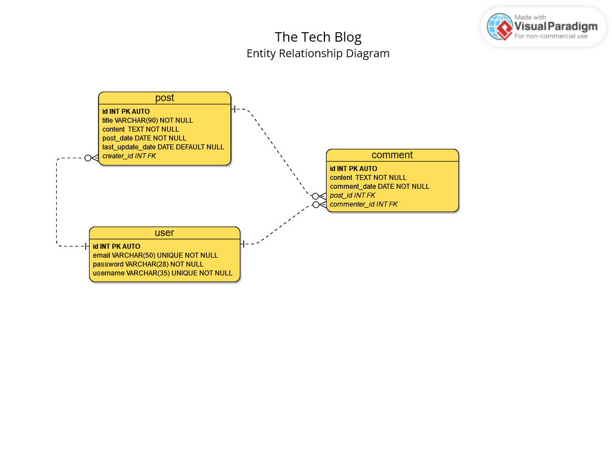
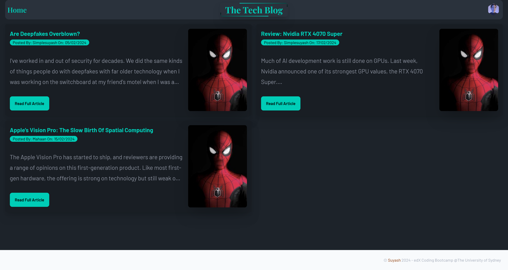
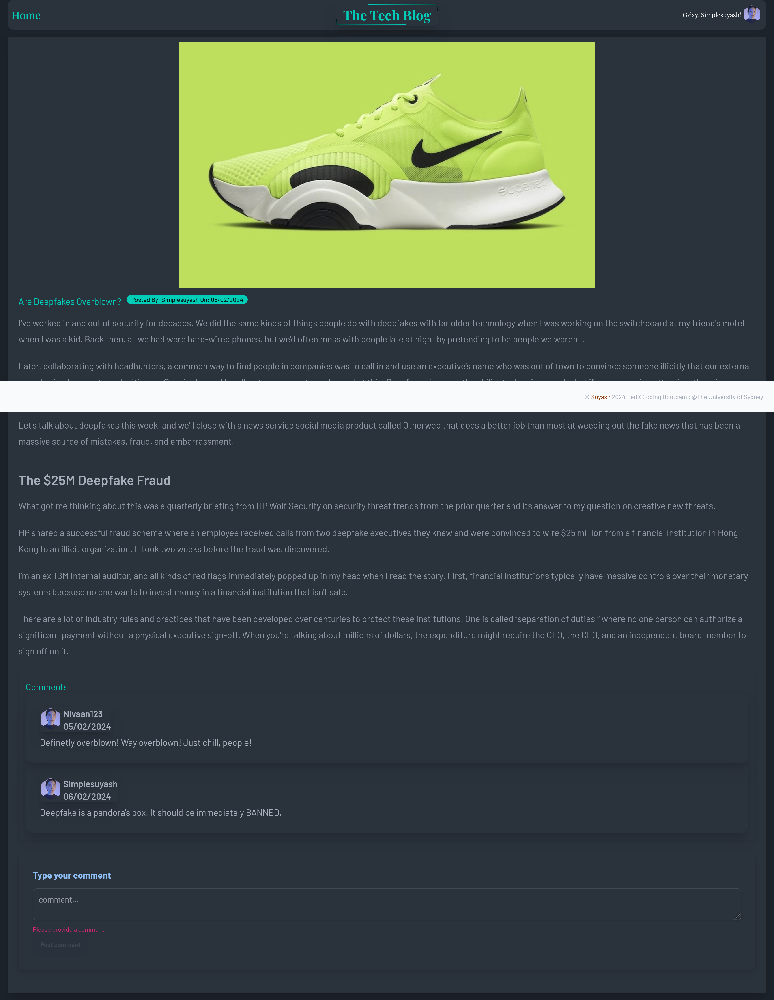
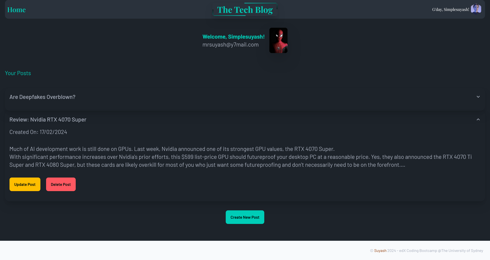
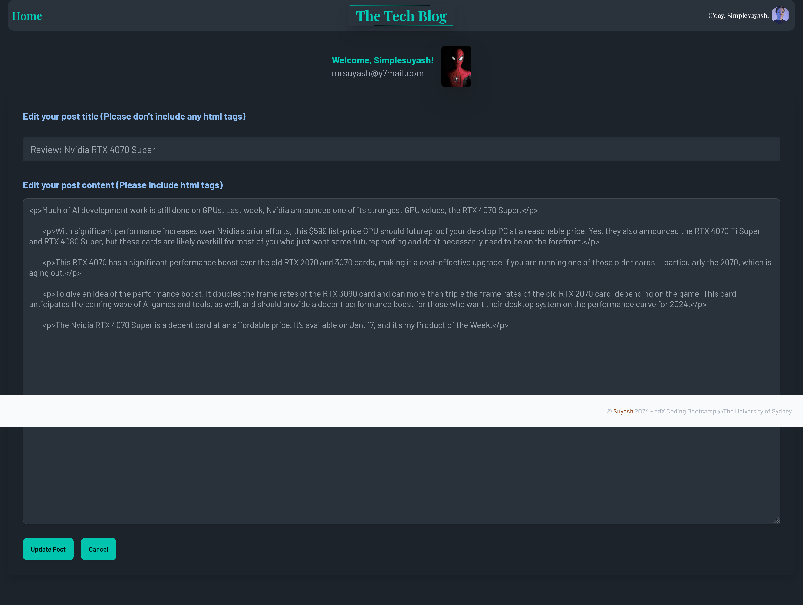
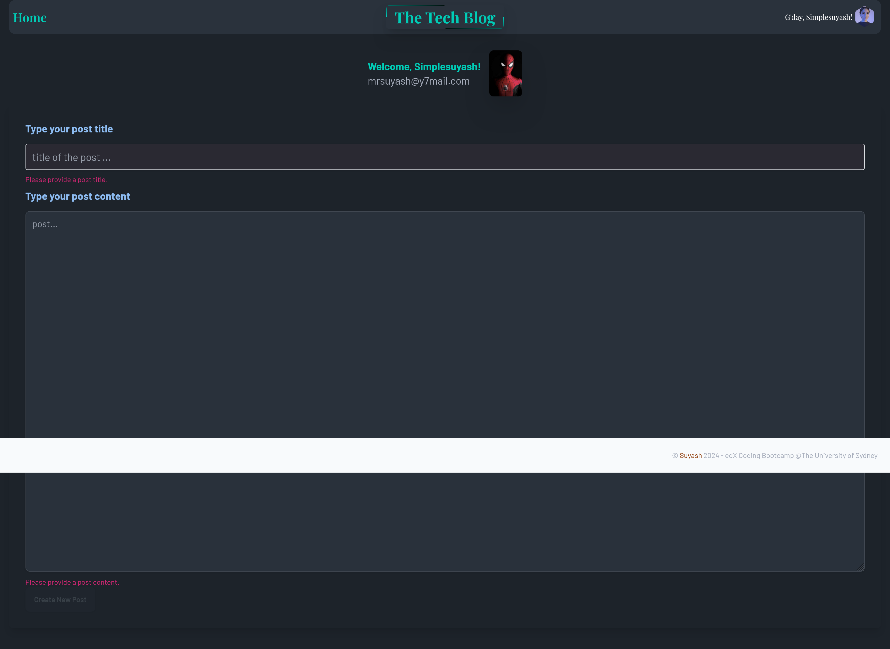

[](https://nodejs.org/en) [](https://www.npmjs.com/) [](https://expressjs.com/) 
[](https://www.mysql.com/) [](https://www.npmjs.com/package/dotenv) [](https://sequelize.org/) [](https://www.npmjs.com/package/bcrypt) [](https://day.js.org/en/)  [](https://tailwindcss.com)  [](https://daisyui.com/) [](https://jquery.com/) [](https://handlebarsjs.com/) 


<div align="right"> 
<a href= "http://www.wtfpl.net/about/"></a>
</div>

# The Tech Blog 

This app is a full-stack application that uses all three `MVC` components.

##  Description

This app is a `CMS-style` blog site similar to a Wordpress site, where developers can publish their blog posts and comment on other developers’ posts as well. It follows the `MVC` paradigm in its architectural structure, using `Handlebars.js` as the templating language, `Sequelize` as the ORM, `MySQL` as the database, and the `express-session` npm package for authentication.

## Table of Contents

1. [Installation](#installation)
1. [Usage](#usage)
1. [Licence](#licence)
1. [Screenshots](#screenshots)
1. [Demo](#demo)


## Installation 

1. Download and install [`node`](https://nodejs.org/en), if you don't have already.
         
1. Install `npm` - node package manager to initialize the project
    ```
    npm init -y
    ```
1. Install nodemon as dev dependency to develop the project
    ```
    npm i -D nodemon
    ```
1. Install `MySQL2` database
    ```
    npm i mysql2
    ```
1. Install `Express` server
    ```
    npm i express
    ```
1. Install `Sequelize` ORM
    ```
    npm i sequelize 
    ```
1. Install `dotenv` to securely store password  
    ```
    npm i dotenv
    ```
1. Install `dayjs` for date/time manipulation
    ```
    npm i dayjs
    ```
1. Install `bcrypt` to hash user passwords  
    ```
    npm i bcrypt
    ```
1. Install `Express session` to create user cookies
    ```
    npm i express-session   
    ```
1. Install `Express session sequelize` to store session in SQL
    ```
    npm i connect-session-sequelize 
    ```
1. Install `tailwindcss` CSS framework as dev dependency, and initialize it. For more information, refer to [tailwindcss](https://tailwindcss.com/)
    ```
    npm i -D tailwindcss
    npx tailwindcss init
    ```
1. Install tailwindcss `typography plugin` to add beautiful typographic defaults to the html content rendered by server. For more information, refer to [tailwind typography](https://github.com/tailwindlabs/tailwindcss-typography)
    ```
    npm i -D @tailwindcss/typography
    ```
1. Install `daisyUI` tailwindcss plugin, an open-source component library
    ``` 
    npm i -D daisyui@latest
    ```
    *Note: All dev dependency modules are optional. Also, I highly recommend that [ESLint](https://eslint.org/) and [Prettier](https://prettier.io/) dev dependencies be used to have your code fixed and formatted for you.*

1. Finally, install `Handlebars` to create webpage templates
    ```
    npm i express-handlebars
    ```

## Usage

To use this project locally,
- Get a copy of this repo to your local machine.
- Install the `Node Module`
    ```
    npm i
    ```
- Change the `.env copy` file to `.env` and insert your database name, user and password
- Change the directory to `db` folder, and type in the following, and followed by your password to connect to your database 
    ```
    mysql - u root -p;
  ```
- Source the `schema`
    ```
    SOURCE schema.sql;
    ```
- Then, change the directory to the root of the project, and type in the following:
    ```
    npm run seed;
    ```
- And, start the `Express Server` by typing in the following:
    ```
    npm run start
    ```

## Licence

This app is licensed under [**WTFPL**](http://www.wtfpl.net/about/)

## Screenshots

Enitity Relationship Diagram      
  

Home Page     
       

Post Detail Page     
       

User Dashboard Page   
       

Edit Post Page    
       

Create New Post Page      
       

## Issue
This app has still some bugs.
1. The navigation links are functioning properly. However, the back button doesn't work as expected. I need to learn more about `location.replace` etc and fix this.
1. The pictures are only place holders. They are not dynamic. So, user file upload function is still lacking in this app.
1. Some new data is not rendered correctly as the seeds data. 

## Deployed Website Link
[App in Heroku](https://simplesuyash-tech-blog-97da35edb183.herokuapp.com/)
